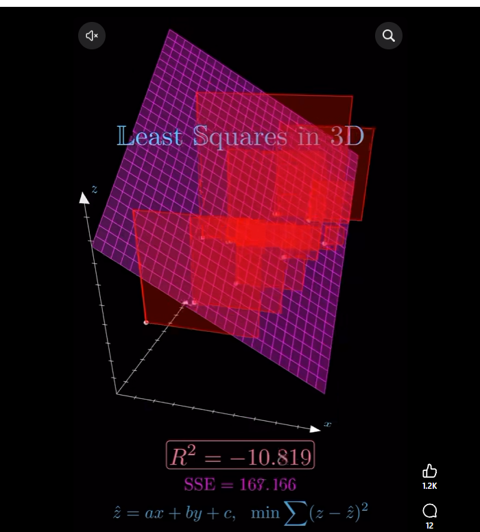
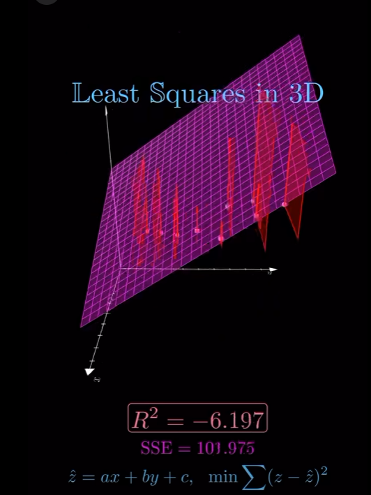
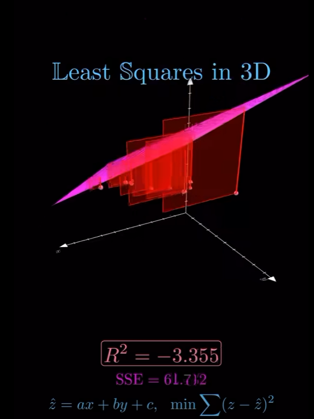
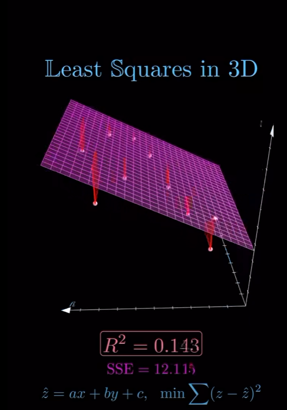
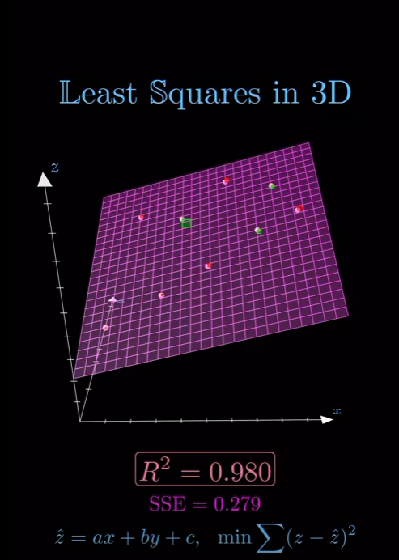

# Step 51 — Least Squares in 3D

> Parked here to pick up once Step 50 (Model C) is done.

Least squares is one of the most important ideas in statistics, data science, and machine
learning. Given a collection of data points, the goal is to find the line that best represents
the overall trend. Instead of forcing the line through every point, least squares minimizes the
sum of the squared vertical distances between the observed data and the predicted values from
the model. Squaring the errors ensures that larger mistakes are penalized more heavily and
prevents positive and negative errors from canceling each other out. This approach produces the
familiar line of best fit used in linear regression and helps reveal relationships hidden within
noisy real-world data.

The concept extends naturally into three dimensions. Instead of fitting a line to points on a
two-dimensional graph, we can fit a plane to points scattered throughout 3D space. The least
squares method finds the plane that minimizes the sum of the squared distances between the
observed points and the values predicted by the plane. This allows analysts to model situations
involving two independent variables and one dependent variable, such as predicting house prices
using both size and age, or estimating temperature using latitude and elevation. By extending
least squares into 3D and beyond, the same mathematical principles can be used to analyze complex
datasets with many variables while still finding the best overall fit.

*Like and follow mathswithmuza for more!*

## Images — "Least Squares in 3D" plane fit, from poor to strong

Same underlying data, watching the fitted plane converge as R² improves from strongly negative
(worse than just predicting the mean) up to a strong 0.980 fit.

### R² = -10.819, SSE = 167.166

### R² = -6.197, SSE = 101.975

### R² = -3.355, SSE = 61.712

### R² = 0.143, SSE = 12.115

### R² = 0.980, SSE = 0.279

